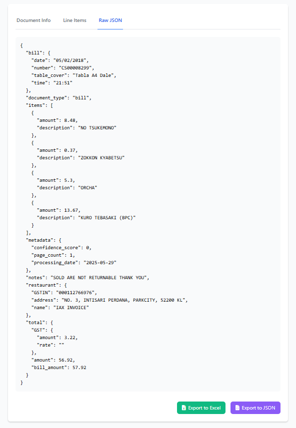

# Intelligent-Document-Processing
A powerful PDF data extraction tool that uses Groq's LLM API to intelligently process and extract structured data from both text-based and image-based PDFs. Built with FLask and html for a modern, user-friendly interface.

## 🌟 Features

- **Intelligent PDF Processing**
  - Handles both text-based and image-based PDFs
  - Automatic detection of PDF type
  - OCR support for image-based documents using EasyOCR
  - High-quality text extraction using PyMuPDF

- **Advanced Data Extraction**
  - Uses Groq's LLM API for intelligent data parsing
  - Extracts structured information like:
    - Document type and number
    - Dates and payment terms
    - Vendor and customer information
    - Line items with quantities and prices
    - Tax information and totals

- **Backend**
  - Flask
  - Real-time data change compatibility
  - Live preview of extracted data
  - with html provides ui

- **Export Options**
  - Excel export with multiple sheets
  - JSON export for structured data
  - Automatic file naming with timestamps
  - Clean temporary file management

## 🚀 Getting Started

### Prerequisites

- Python 3.8 or higher
- Groq API key ([Get one here](https://console.groq.com))

### Installation

1. Clone the repository:
```bash
git clone https://github.com/Gowtham0810-hype/Intelligent-Document-Processing.git
cd Intelligent-Document-Processing
```

2. Install required packages:
```bash
pip install -r requirements.txt
```

3. Create a config.ini file with your Groq API key:
```ini
[Groq]
api_key=your_api_key_here
```

### Running the Application

Start the application with:
```bash
python app.py
```

## 📖 Usage

1. **Upload PDF**
   - Use the file uploader to select your PDF document
   - Both text-based and image-based PDFs are supported

2. **Process Document**
   - Click the "Process Document" button
   - The system will automatically detect the PDF type and process accordingly

3. **View and Edit Data**
   - Document Info tab: View and edit basic document information
   - Line Items tab: Manage line items with dynamic row editing
   - Raw JSON tab: View the complete structured data

4. **Export Data**
   - Use the "Export to Excel" button for spreadsheet format
   - Use the "Export to JSON" button for structured data format

## Screenshots
### payment receipt image as pdf


### web app screenshot




## 🔧 Technical Details

### Components

- **Frontend**: Html
- **Backend**: Flask
- **PDF Processing**: PyMuPDF (fitz)
- **OCR Engine**: EasyOCR
- **LLM Integration**: Groq API
- **Data Processing**: Pandas
- **Export Handling**: XlsxWriter, JSON


## 📝 License

This project is licensed under the **GNU Affero General Public License v3.0 (AGPL-3.0)**. See the [LICENSE](LICENSE) file for more details.

